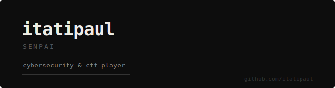

&nbsp;

cybersecurity enthusiast, ctf player, open source tinkerer.  
i break things on purpose and write about it.

&nbsp;

**tools** &nbsp;·&nbsp; python &nbsp;·&nbsp; linux &nbsp;·&nbsp; nmap &nbsp;·&nbsp; burp suite &nbsp;·&nbsp; wireshark &nbsp;·&nbsp; ghidra

&nbsp;

**ctf write-ups**

- [SK-CERT CyberGame 2026](https://github.com/itatipaul/SK-CERT-CYBERGAME-2026)
- [SK-CERT CyberGame 2025](https://github.com/itatipaul/cybergame2025)

**projects**

- [vpn-launcher](https://github.com/itatipaul/vpn-launcher) — gui tool for managing openvpn & wireguard on linux
- [penetration-testing-handbook](https://github.com/itatipaul/penetration-testing-handbook) — pentesting notes & cheatsheets

&nbsp;

